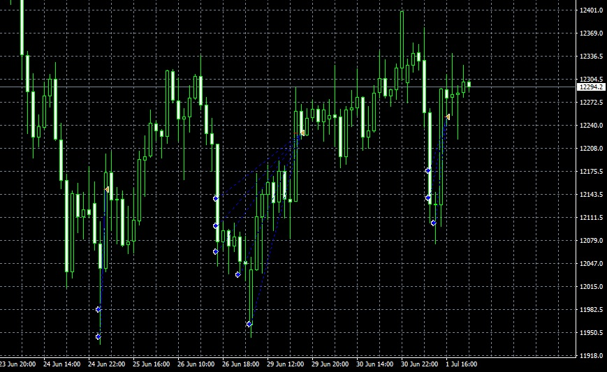

# Trading Bot
  #### 1. Subject of project
  &nbsp;&nbsp;&nbsp;&nbsp; Trading bot detects "panic" and places orders according to calculated position size and frequency.
  Orders are being placed mostly on DAX, which is german blue chip stock market index. 
  Language used in this project is C++ based MQL4 supported by popular trading platform MetaTrader 4. 
  Main purpose of the project was to develop my programming skills and broaden my financial markets horizons.

  #### 2. How it works?
  &nbsp;&nbsp;&nbsp;&nbsp; Bot uses commonly known strategy of averaging price of purchase, and high probabilty of Index recovery after panic. 
  This strategy may be dangerous when used with too high leverage or badly calculated position size. 
  The program calculates position size based on assumed price reduction. 
  To maximize profit strategy uses trailing stop, which is following the price as long as it rises, 
  and closing positions after price drop. You can see strategy in operation on chart below. 
    
    

    
